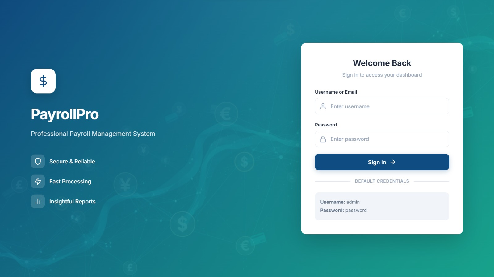
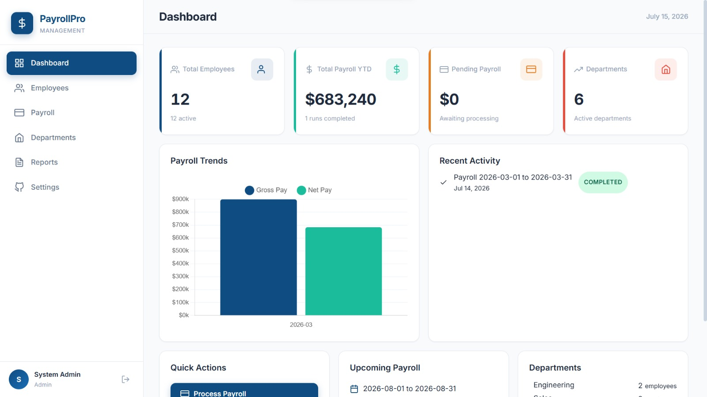
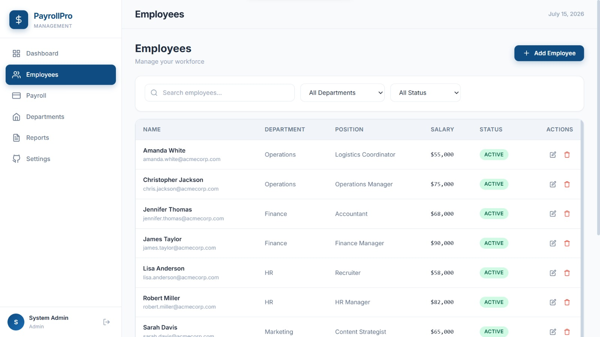
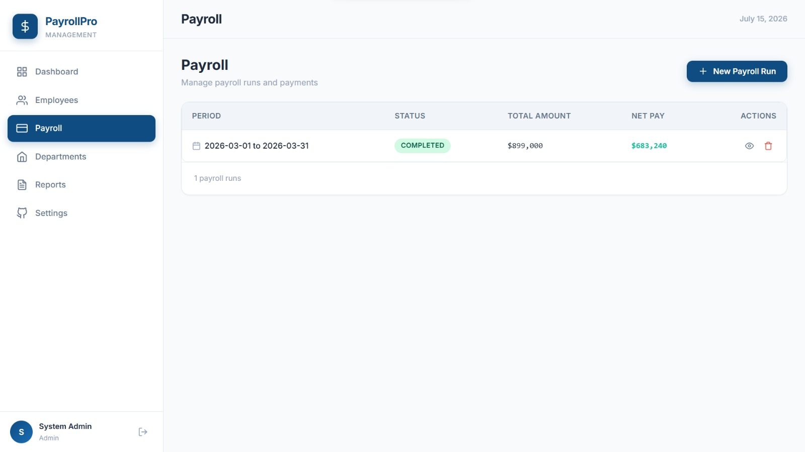
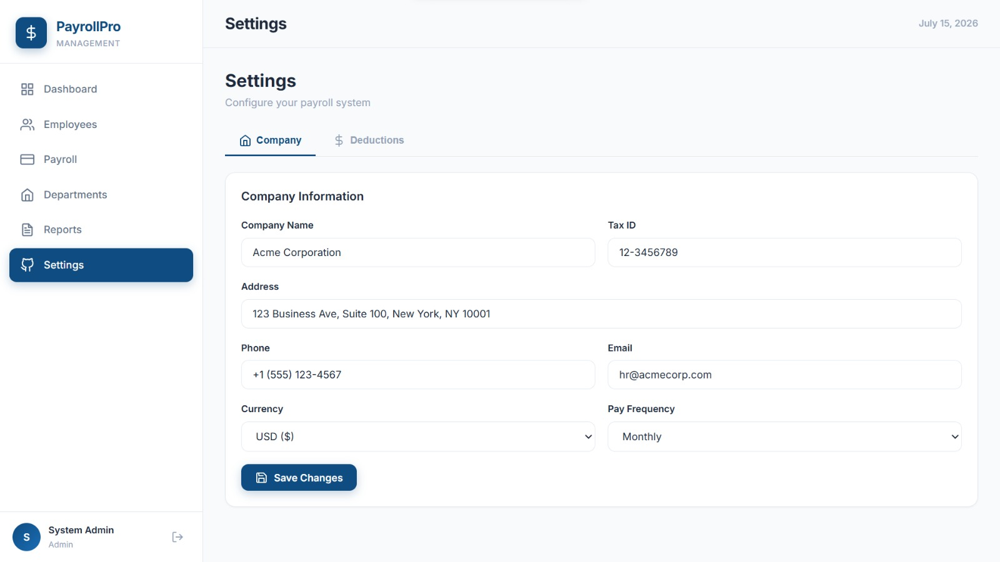
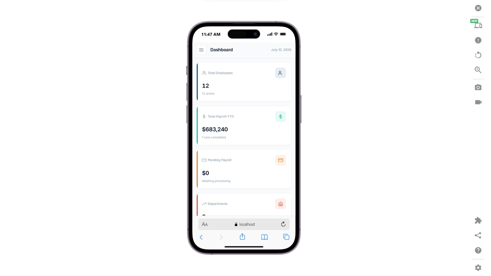

# Professional Payroll Management System

A modern Payroll Management System designed to simplify employee payroll processing, salary computation, department management, and payroll reporting for organizations of all sizes.

> **Note:** This repository showcases the project's features, architecture, and documentation. The complete source code is maintained privately.

---

## 🚀 Overview

This is a comprehensive payroll management application that automates payroll processing, employee administration, department management, and financial reporting. The system minimizes payroll errors, improves administrative efficiency, and provides organizations with accurate salary records and insightful payroll analytics.

---

## ✨ Key Features

- Secure User Authentication
- Employee Management
- Department Management
- Payroll Processing
- Automatic Salary Calculations
- Tax & Deduction Management
- Printable Payslips
- Payroll Reports & Analytics
- Dashboard Statistics
- Responsive User Interface

---

## 🛠 Technology Stack

### Frontend

- HTML5
- CSS3
- Vanilla JavaScript

### Backend

- PHP

### Database

- MySQL

### Visualization

- Chart.js

---

## 📸 Project Screenshots

### Login

---

### Dashboard

---

### Employees

---

### Departments

---

### Payroll Processing

---

### Reports

---

### Settings

---
### Add Employee

---

### Add Department

---

### Add Payroll

---

### Responsiveness

---

## 🏗 System Architecture

Employee / HR Officer / Administrator

↓

PHP Backend

↓

Business Logic

↓

MySQL Database

↓

Payroll Reports & Dashboard

---

## 👥 User Roles

### Administrator

- Manage Employees
- Manage Departments
- Configure Payroll Settings
- Manage Users
- View Reports
- System Administration

### HR Officer

- Process Payroll
- Manage Employee Records
- Generate Payslips
- View Payroll Reports

---

## 🎯 Use Cases

- Corporate Organizations
- Small & Medium Businesses
- Schools
- Government Agencies
- Private Institutions

---

## 🔐 Security Features

- Secure Authentication
- Role-Based Access Control
- Session Management
- Input Validation
- Prepared Statements
- Password Hashing

---

## 📈 Project Highlights

- Automated Payroll Processing
- Department Management
- Salary & Deduction Calculations
- Interactive Dashboard
- Payroll Analytics
- Responsive Design

---

## 📌 Project Status

✅ Completed

---

## 📬 Contact

For demonstrations, collaboration, or licensing inquiries:

**Kelly**

Full-Stack Web Developer

> Source code is maintained privately. Demonstrations and licensing discussions are available upon request.
